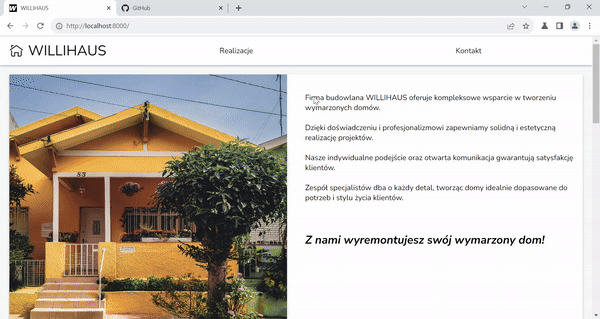
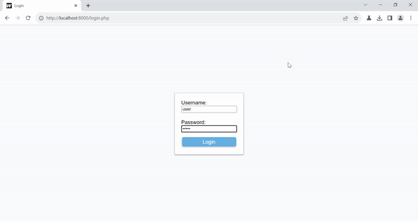

# BuilderProject

### Description
&nbsp;&nbsp;&nbsp;&nbsp;A web page designed for a building company.
It's main goal is to provide contact information, the companies field of operation and show of it's already realized project.

### Key Features
&nbsp;&nbsp;&nbsp;&nbsp;Besides the main page containing information about the company, the page also has a gallery of finished projects, a gallery of images for a given project and a administration panel, where the owner can log in, manage realizations and add images to them.

The main page:

The realizations:

An example relaization:

The administrative panel:

### Tech stack
- PHP 8,
- HTML/JS/CSS

### Useful Commands
In the projects folder write: 
&nbsp;&nbsp;&nbsp;&nbsp;`php.exe -S 0.0.0.0:8000` 
to start the server.